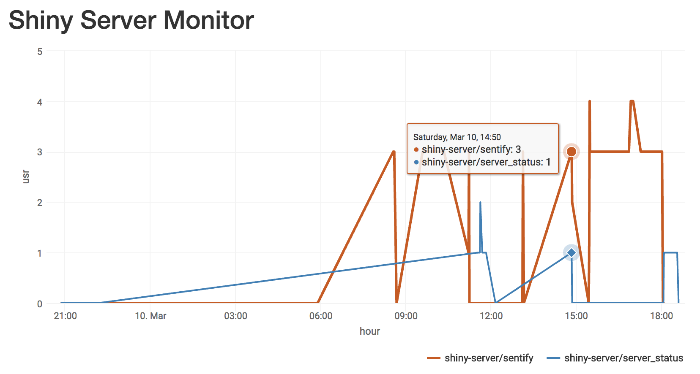

    
<!-- README.md is generated from README.Rmd. Please edit that file -->
    
# Shiny Usage Monitor

```{r, echo = FALSE}
knitr::opts_chunk$set(
    collapse = TRUE,
    comment = "#>",
    fig.path = "man/figures/README-"
)
```

Using Shiny Server Open Source? Want to see how many people are using your apps? This app allows you to monitor the number of users on your Shiny Server by continuously parsing through your server's logs and charting the data over time.



## Know thyself
Keeping track of the number of users on your Shiny Server is helpful for several reasons: 

* Identifies low-traffic periods (best times to push updates or restart the server)
* Tells you if you need to pay more attention to scaling your apps (i.e. adjust server size, optimize slow apps)
* Shows which apps are most popular

## Basic architecture
1. Deploy Shiny Server Open Source with one or more apps
2. Continuously check your server's logs and save off data on the number of users on each app (`check_server.R` plus a cronjob)
3. Use Shiny to display the data over time (`app.R`)

## Installation
##### 1: Add `app.R` and `check_server.R` into a new directory `/server_status` in the same location as your shiny apps.
##### 2. Install required packages for `app.R`
```{r, eval = FALSE}
install.packages(c('shiny', 'tidyverse', 'lubridate', 'highcharter'))
```
##### 3. Set up a cron to run `check_server.R` every minute. First, open up your crontab file: 
```{bash, eval = FALSE}
crontab -e
```
Then add this line to the end of the file:
```{bash, eval = FALSE}
* * * * *  sudo /usr/bin/Rscript /srv/shiny-server/server_status/check_server.R
```

Now you'll have real-time data on your users henceforth! You should now see a minute by minute graph for today's server usage in your `/server_status` app. You can also check out `sysLoad.RData` to see the raw data. 

```{r, eval = FALSE}
load('sysLoad.RData')
head(Dat)
                 Time   PID  USER PR NI   VIRT   RES  SHR S  CPU MEM    TIME usr                        app
1 2018-03-09 22:01:01 23290 shiny 20  0 293872 98472 9480 S  0.0 4.8 0:02.93   1 shiny-server/server_status
2 2018-03-09 22:01:17 23290 shiny 20  0 293872 98472 9480 S  0.0 4.8 0:02.96   0 shiny-server/server_status
3 2018-03-09 22:22:27 24511 shiny 20  0 258208 79728 7388 R 98.8 3.9 0:01.31   0       shiny-server/sentify
4 2018-03-09 22:53:17 26042 shiny 20  0 297064 98272 8180 R 52.7 4.8 0:02.62   1       shiny-server/sentify
5 2018-03-09 22:53:22 26042 shiny 20  0 297204 98492 8260 S  0.0 4.8 0:02.91   0       shiny-server/sentify
6 2018-03-09 23:52:58 29000 shiny 20  0 245316 78764 6808 R 98.7 3.8 0:01.12   0       shiny-server/sentify
```

There you have it! For a live example, go [here](http://rcharlie.net/server_status/).